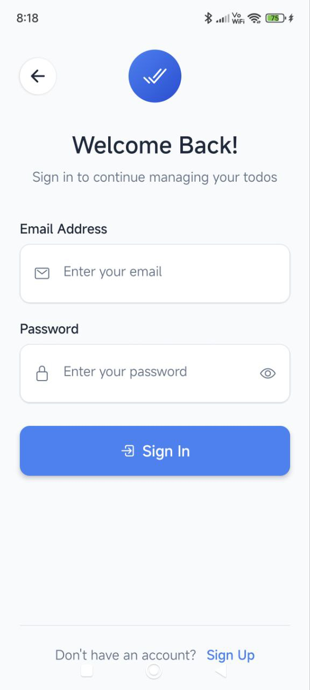
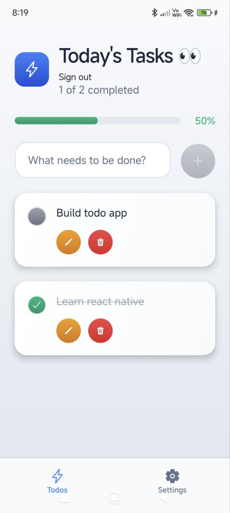
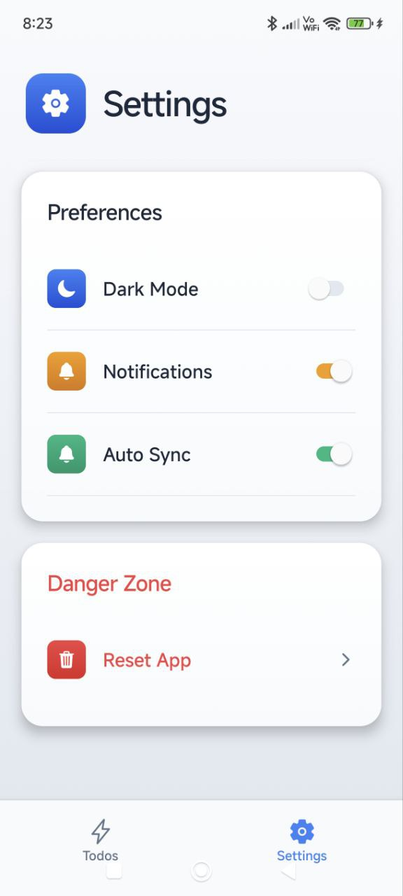
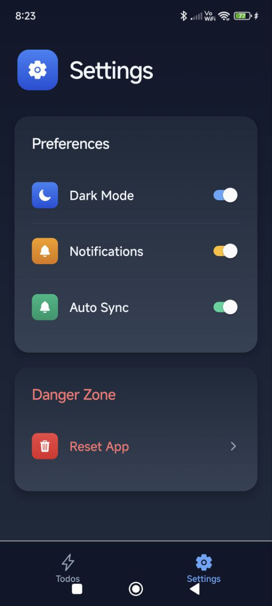

# 📋 React Native Todo App

A cross-platform **Todo App** built with **React Native**, **Clerk** for authentication, and **Convex** as the backend database and real-time API.

## 🚀 Features

- ✅ Create, edit, and delete todos
- 🔐 Authentication powered by Clerk
- ☁️ Real-time data sync using Convex
- 📱 Beautiful and responsive mobile UI
- 🧠 Simple and clean code structure

## 🛠️ Tech Stack

- **React Native** – UI framework for building native apps
- **Clerk** – Authentication and user management
- **Convex** – Serverless backend with real-time support
- **Expo** – Easy development and testing
- **TypeScript** – Static type checking

## 📸 Screenshots

| Login                                    | Home                                        |
| ---------------------------------------- | ------------------------------------------- |
|  |      |
| Todos                                    | Settings                                    |
| ---------------------------------------- | ----------------------------------------    |
|  |  |

| Dark Mode                               |
| --------------------------------------- |
|  |

## 📦 Installation

```bash
git clone https://github.com/a7mdmo74/todo-app.git
cd todo-app
npm install
```
